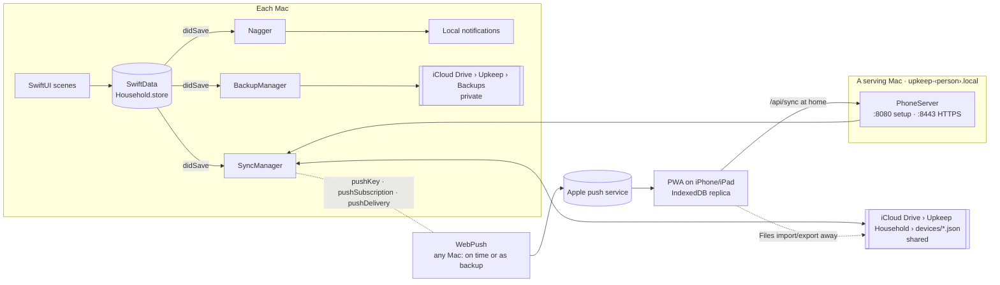
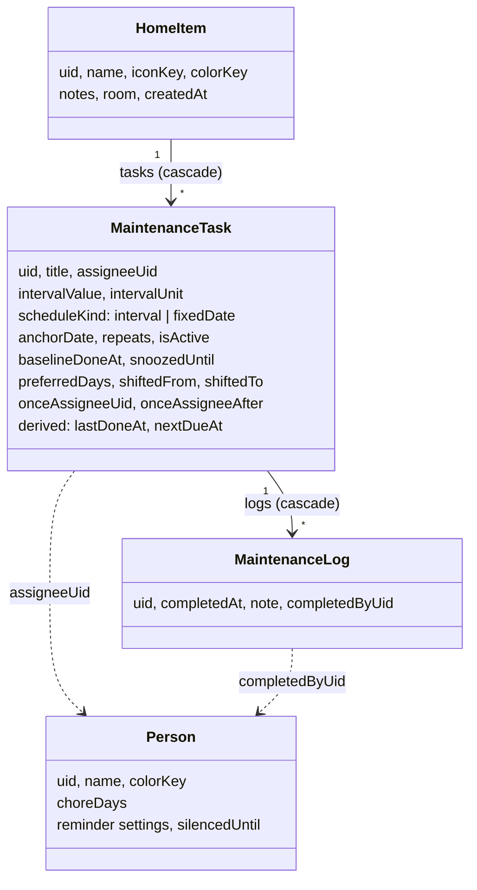

# 🏠 Upkeep

> [!abstract] TL;DR
> A small native **macOS menu bar app** for routine home maintenance. Add the things in your home (dishwasher, windows, floors, robot vacuum…), give them repeating tasks, tick them off, keep a history — and let Upkeep **nag you with notifications** until the job is done or you tell it to be quiet.

Related: [[Home]] · [[Personal Projects]] · [[Investment Dashboard]] (same "personal build" approach)

---

## 👤 For people who use it

### Who it's for
- Anyone who forgets when they last descaled the coffee machine, cleaned the dishwasher filter or tested the smoke alarm.
- Households that want a **quiet, local, no-account** tool rather than a subscription app.
- People who respond to gentle, repeated reminders — not a single notification that's easy to swipe away.

### Core ideas

| Concept | What it means |
|---|---|
| **Item** | A thing in the home: an appliance, the windows, the floors, a pet. Has an icon, colour, notes (model number, filter type, where the manual is) and an optional **room**. |
| **Task** | A recurring chore on an item, e.g. *Clean the filter — every month*. |
| **Log** | A record each time a task is done, with optional note. Forms the item's **history**. |
| **Room** | Free-form grouping (Kitchen, Bathroom…). Items without one fall under *Other* / *Home*. |

### Two kinds of schedules

> [!tip] Interval vs fixed date
> - **Interval** — due a set time *after it was last done*. "Every 3 months." Do it late, and the next one shifts later too.
> - **Fixed date** — due on *calendar dates* regardless of when you actually did it. "Every year on 15 Sep" (service the AC before winter), or **once** on a specific day. Doing it a bit early or late counts for the nearest date, so nothing is skipped or doubled.

### Chore days

> [!tip] Not just a random Tuesday
> Setup asks **when you usually get chores done** — most households answer "weekends". Ordinary
> chores then land on those days instead of whichever day you happened to add them, and stay there
> even when you tick one off mid-week: the date snaps to the *nearest* preferred day.

- Anything that comes round rarely enough that the **date** matters — a yearly AC service, a
  quarterly filter, a fixed date — ignores chore days and keeps its own date. So does anything
  due more often than weekly. Upkeep picks this from the interval; you can override it per task.
- An interval task can also be given a **start date**: *first due on Saturday*, and the interval
  counts from there.

### Moving one thing

Life happens, so **Move…** on any task asks what a calendar asks: **this time only**, or **this and
all future times**. Moving just this one leaves the series alone; moving all future ones puts an
after-last-done task on the new day of the week, or slides a whole fixed-date series along. It's on
the Mac's task menu and calendar, and on the phone.

The same goes for who does it: the task menu's **Responsible › Just This Time** (or tapping the
person on the phone) hands only the next one to someone else. Once it's done, the task goes back to
its usual person.

Tasks can also be **paused** (keep history, never nag) and **snoozed** individually.

### Getting started
1. Open Upkeep → **Add Item** (`⌘N`).
2. Pick from **45 ready-made household items** — searchable, grouped by category (Kitchen, Laundry, Bathroom, Living & Bedroom, Heating/Cooling/Air, Cleaning incl. robot vacuum, Safety, Other).
3. Each template comes with **suggested routines**. Tick the ones you want, and tweak their schedules before adding.
4. Say whether you know when each was last done, or start fresh.
5. Close the window — Upkeep keeps living in the **menu bar**.

### Everyday use

- **Up Next** — everything due now and coming up, grouped **by date** or **by room**. **Done** lists what was actually ticked off this week, with Undo; a "last done" date entered when adding an item doesn't count.
- **Calendar** — month grid with item icons on each day. The first occurrence is real; later ones are *projected* ("where it would land if you do it on time"). Overdue tasks sit on today.
- **Item detail** — tasks, paused tasks, history, and suggestions from the template you haven't added yet (**Manage** routine).
- **Menu bar tray** — what's due now & this week, **one-click done**, and *Silence for 1 day / 3 days / a week*.
- **Dock badge** — count of tasks needing attention.

### The nagging 🔔

> [!warning] It's supposed to be a bit annoying
> Reminders repeat every **N hours** during **active hours** (default 9:00–21:00, every 3h) on the days you choose, until you act.

- Notification actions: **Mark as Done**, **Remind Me Tomorrow**, **Silence All for 3 Days**.
- Several due tasks are bundled into one notification ("3 maintenance tasks are waiting").
- Optional **work schedule**: no reminders during work hours on work days (default Mon–Fri 9–17).
- Reminders come while Upkeep runs (closing the window keeps it in the menu bar). **Quit** it and they stop until you open it again.

### Household 👥
- Everyone in the home shares one **iCloud Drive folder** (*Upkeep Household*). Each Mac and phone keeps a full copy; there's no master and no server.
- **People**: add them in Settings › Household. Each task can have a **responsible person**; unassigned tasks are for everyone. Up Next and the menu bar have a **Mine / Everyone** filter; history shows *by <name>*.
- Your reminders (and badge) cover tasks assigned to **you or everyone**, with **your** reminder settings — they follow you to all your devices.
- Invite: Settings › Household › **Invite…** (or Finder › Share) with edit permission; they choose **Join** on first launch.
- **Switch Household…** (Settings › Household) moves a Mac that's already in a household to another — say a partner set up their own before accepting the invitation. Nothing is deleted in the household it leaves. It either starts fresh (its own copy is cleared without tombstones, who's-using-this-Mac is forgotten and its phones are unpaired, so nothing mixes in) or brings its items along into the new one; a backup is made first. Setup then lists every household folder in iCloud Drive except the one it left (a shared one may be named "Upkeep Household 2"). A new household always gets a folder name that isn't taken yet.

### Phones & tablets 📱
- A Mac turns on Settings › Phones › **Serve Upkeep to phones and tablets** and shows two QR codes: install/trust a profile once, then open the app and **Add to Home Screen**. Each serving Mac answers at `upkeep-<its person>.local`, so both partners' Macs can serve their own phones. **Network Name** shows whether each name answers (and why not), keeps `upkeep.local` for phones set up with an older version, and **Reset Network Name** re-announces them.
- On the phone: everything the Mac does with the household — see what's due (Mine/Everyone), **mark done**, **move** an occurrence or **hand it to someone else** this time, **add items** from the same catalog, **edit tasks and schedules**, manage the routine, remove history, and manage **people** and your **reminder settings**. The shared folder, pairing, serving phones and private backups stay on the Mac.
- Syncs with the Mac automatically on the home Wi-Fi; away from home it still works and can sync through **Files**.
- **Reminders** arrive by Web Push from the Mac the phone paired with (while it's awake, anywhere with internet), following that person's settings. Macs with **Also send reminders when the usual Mac can’t** step in a few minutes late when it hasn't; the settings list who covers each phone, and the phone's own Settings says the same.
- Updating the Mac app updates the phone app the next time it's opened at home.

### Backups
- A **sync status** and a green/red **backup status** sit at the bottom of the sidebar.
- Each Mac keeps **private daily backups of the whole household** in **iCloud Drive › Upkeep › Backups**.
- **Export…** / **Restore…** in Settings › Backups. A restore reaches the whole household; your current data is saved as a *before restore* file first. **Merge from File…** (Household) adds a file's data without replacing anything.

### Erase everything
- **Settings › Household › Erase Everything…** is a complete reset, behind a confirmation you have to tick. It deletes the household from iCloud Drive (every device's file in the shared folder) and your private backups, then everything on this Mac: the store, phone certificates, settings and window state. Upkeep then reopens as if newly installed.
- Phones have to be paired again and trust the new certificate; other Macs keep their own copy until they're reset too.
- Only Upkeep's own files are deleted from iCloud Drive: a folder goes only once nothing else is left in it, so picking the wrong folder as a household can never cost anything else. Not offered in demo mode.

### Settings at a glance
- **Reminders**: your interval, active hours, weekdays, chore days, work schedule, silence, notifications, open at login
- **Household**: people, "this is me", folder, devices, invite, switch household, sync now, merge from file, erase everything
- **Phones**: serve to phones, phone name (Change…), network name (older phones, reset), reminders to phones (help as a backup, who covers which phone), pair (QR codes), paired phones, test notification, new certificate
- **Backups**: back up now, export, restore

---

## 🛠️ For developers

### Stack & constraints

> [!info] Personal build
> SwiftUI + SwiftData, **no sandbox, no CloudKit, no paid developer account, no servers**. Signs to run locally. The database stays on each Mac; iCloud Drive syncs plain JSON files.

- Store: `~/Library/Application Support/Upkeep/Household.store` — explicitly *not* SwiftData's shared `default.store`.
- The sync contract shared with the PWA is **[`Docs/Sync.md`](Sync.md)**; the file format is `Docs/upkeep-household.v1.schema.json`.

### Architecture



### Sync in one paragraph
Every synced model conforms to `SyncableModel` (`Core/SyncStore.swift`) and becomes a record `{kind, uid, modifiedAt, modifiedBy, data}`. Before every export, `SyncStore.stampChanges` compares each record's canonical data with what it was last stamped/merged with and stamps changed ones with the hybrid clock. `Merge` (`Core/SyncCore.swift`) is last-writer-wins per record plus tombstones; it's commutative and idempotent. After applying a merge, derived fields (`lastDoneAt`, `nextDueAt`) are recomputed by `Schedule.derive` on every device. Unknown kinds and unknown keys from newer builds are kept and passed on. New modules (shopping list, pantry…) add models to `SyncRegistry.kinds` — no format change.

### Data model



Plus `TombstoneEntry` (deletions) and `UnknownRecord` (kinds from newer builds). Every synced model also has `modifiedAt`, `modifiedBy` and `syncRaw` (canonical data last stamped or merged).

### Source map

| Path | Role |
|---|---|
| `Upkeep/UpkeepApp.swift` | Scenes, `AppState`, `Persistence`, demo data, debug flags |
| `Upkeep/Core/SyncCore.swift` | Record/snapshot format, merge, hybrid clock (pure, tested by `Tools/test-core.sh`) |
| `Upkeep/Core/SyncStore.swift` | `SyncableModel`, registry, stamping, applying merges, deleting, restoring |
| `Upkeep/Core/SyncManager.swift` | Household folder: read peers, merge, write own file, folder watch |
| `Upkeep/Core/People.swift` | `Person`, `Household` (this device's identity and folder) |
| `Upkeep/Core/Backup.swift` | Private rolling backups, export/restore, `FileCoordination` |
| `Upkeep/Core/FactoryReset.swift` | Erase everything: iCloud Drive, this Mac, then a fresh start |
| `Upkeep/Core/PhoneServer/` | HTTPS server, home CA & profile, `upkeep-<person>.local` mDNS, Web Push from any Mac |
| `Upkeep/Core/SelfTest.swift` | `-selftest` two-replica checks |
| `Upkeep/Modules/Maintenance/` | Models, `Schedule` maths, catalog, sync kinds, `Nagger`, views |
| `Upkeep/Views/` | Shell: `ContentView`, `MenuBarView`, `SettingsView`, household & phone settings, components |
| `Web/` | The phone/tablet PWA (Vite + React + TypeScript) |
| `Tools/build-local.sh`, `Tools/build-web.sh`, `Tools/test-core.sh` | Builds and tests |

### How the nagger works
- Rebuilds all pending notifications on any change (debounced 400 ms), on activation and every 15 minutes.
- Clock-aligned slots within the person's active hours, skipping off-days and work hours, for the **current calendar week only** (the same week Up Next shows); at most 48. Next week's are queued by the first reschedule after it starts, so nothing sits in macOS for days going stale.
- Only **my** tasks (assigned to me or everyone) count. Silencing is stored on the person, so it applies on all their devices.
- `WebPush` uses the same slots (`Nagger.nagSlots`) per phone subscription. The Mac a phone paired with sends at the slot; a Mac helping with reminders sends 5 minutes later only if no other Mac reported the slot sent (`PushSchedule`, `pushDelivery`). Either way, while the Mac is awake.

### Build & run

```bash
open Upkeep.xcodeproj
```

```bash
Tools/build-local.sh && open build/local/Upkeep.app
```

```bash
Tools/test-core.sh
```

> [!caution] Gotchas
> - `IconKey` raw values are synced — **never rename** one. Same for record kinds and `data` keys (Docs/Sync.md).
> - Writers must emit every key of a kind; otherwise two builds re-stamp each other's records forever.
> - Both Xcode and local builds share the same store, but have separate device ids and settings.
> - Closing the window doesn't quit; the app stays in the menu bar on purpose.
> - The phone server needs the Local Network permission (prompted on first use) and the macOS firewall to allow incoming connections.

### Ideas / possible next steps
- [ ] Shopping list and pantry/fridge/freezer inventory modules
- [ ] A live transport for syncing away from home without Files
- [ ] Per-item photos / manual attachments
- [ ] Widgets for "due today"
