<p align="center">
  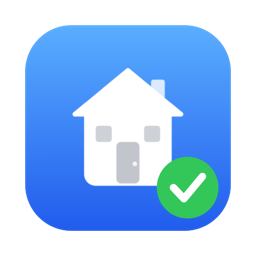
</p>

<h1 align="center">Upkeep</h1>

<p align="center">
  <strong>Home maintenance for the whole household, with reminders that keep nudging until the job is done.</strong>
</p>

<p align="center">
  macOS 15+ &nbsp;·&nbsp; iPhone &amp; iPad &nbsp;·&nbsp; no accounts &nbsp;·&nbsp; no servers &nbsp;·&nbsp; no subscription
</p>

<p align="center">
  Built by <a href="https://bostjan-cigan.com">Boštjan Cigan</a>
</p>

<p align="center">
  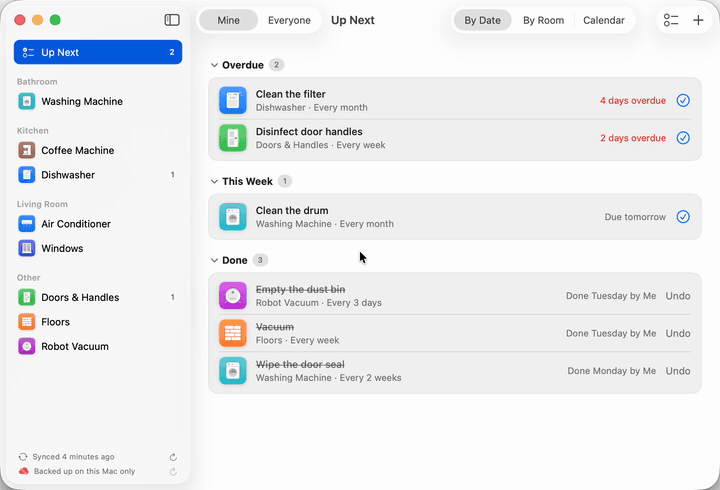
  &nbsp;
  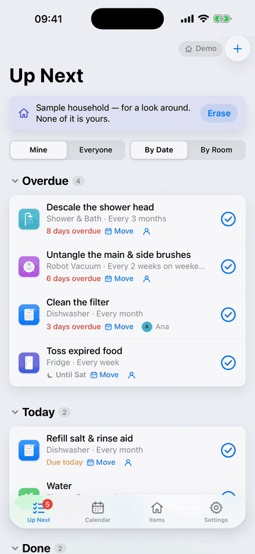
</p>

Upkeep keeps track of the things in your home that need regular care: descaling the coffee machine, cleaning the
dishwasher filter, bleeding the radiators, testing the smoke alarm. Add the things you have, pick the routines you
want, and Upkeep tells you when each one is due. It reminds you every few hours until you tick it off, or until you
tell it to be quiet.

It's built for households. Everyone shares one list, tasks can belong to a person or to everyone, and the history
shows who did what. Upkeep is a native Mac app that lives in the menu bar. iPhones and iPads get a companion app,
served by the Mac over your home Wi-Fi, that keeps working away from home. Everything syncs through a shared iCloud
Drive folder, so there's no account to make and no server to run.

**Contents:** [Installation & user guide](#installation--user-guide) · [Development](#development) · [License](#license)

---

# Installation & user guide

## What Upkeep can do

- **45 ready-made household items.** Dishwasher, washing machine, windows, floors, robot vacuum, boiler, smoke
  detector and more, each with suggested routines you can tick and adjust.
- **Up Next.** What's overdue, due today and due later this week, plus everything already done this week (with
  Undo). Anything further out stays in the calendar instead of in your way. Group it by date or by room.
- **Reminders that don't give up.** Every few hours during your active hours, on the days you choose, until you
  act. Mark as Done, Remind Me Tomorrow or Silence for a few days, straight from the notification. Work hours can
  stay quiet.
- **Chore days.** Tell Upkeep when you usually do chores (most people say weekends) and ordinary chores land on
  those days. Rare jobs with a real date, like a yearly AC service, keep their own date.
- **Two kinds of schedules.** *Every 3 months after it was last done*, or *on fixed dates* (every 15 September, or
  once on a given day).
- **Life happens.** Move a task *this time only* or *this and all future times*, hand it to someone else *just this
  time*, snooze it or pause it.
- **The whole household.** People, a responsible person per task (or everyone), *Mine / Everyone* filters, and a
  history that says who did what. Everyone's reminder settings follow them to all their devices.
- **On your phone.** The iPhone/iPad app does everything the Mac does with the household: tick things off, add
  items, edit tasks and schedules, manage people. It works offline, syncs when you're home and gets reminders as
  notifications.
- **Menu bar tray.** What's due, with one-click Done and Silence, without opening the window.
- **Private daily backups** of the whole household in your iCloud Drive, with one-click restore.

### On the Mac

<p align="center">
  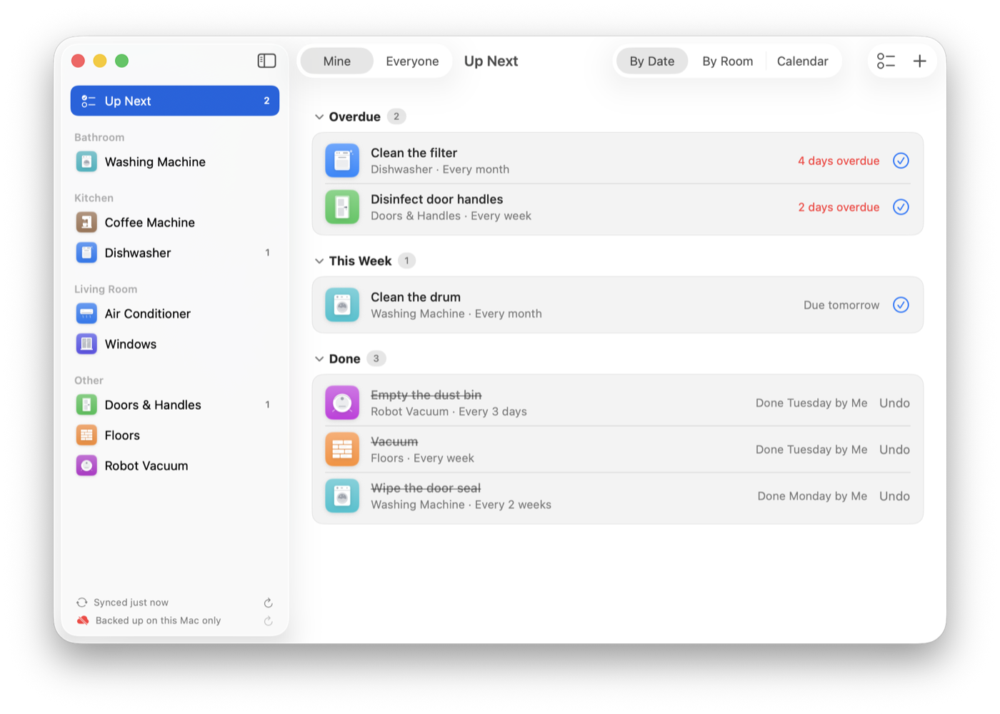
</p>

<p align="center">
  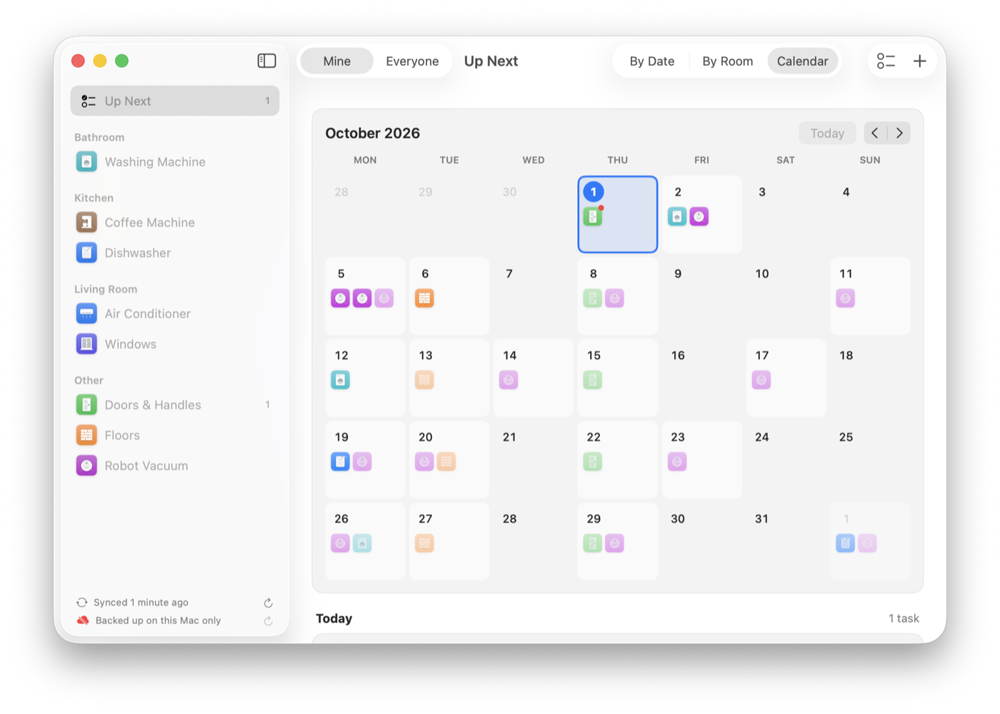
  &nbsp;
  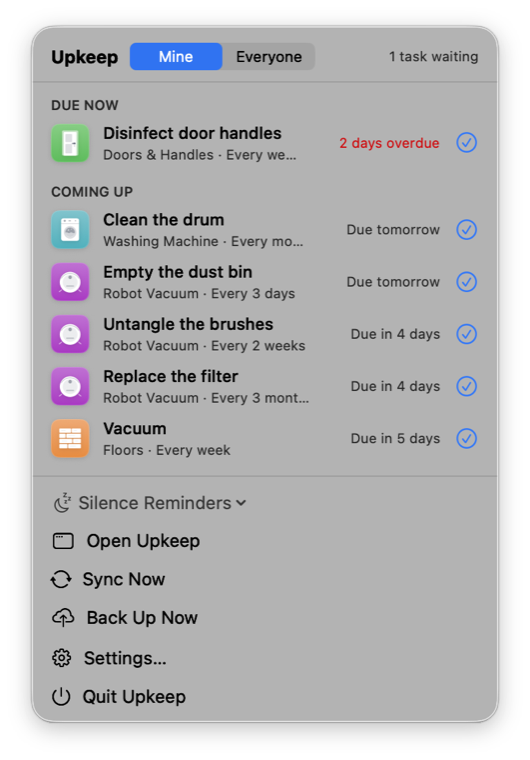
</p>

### On the iPhone and iPad

<p align="center">
  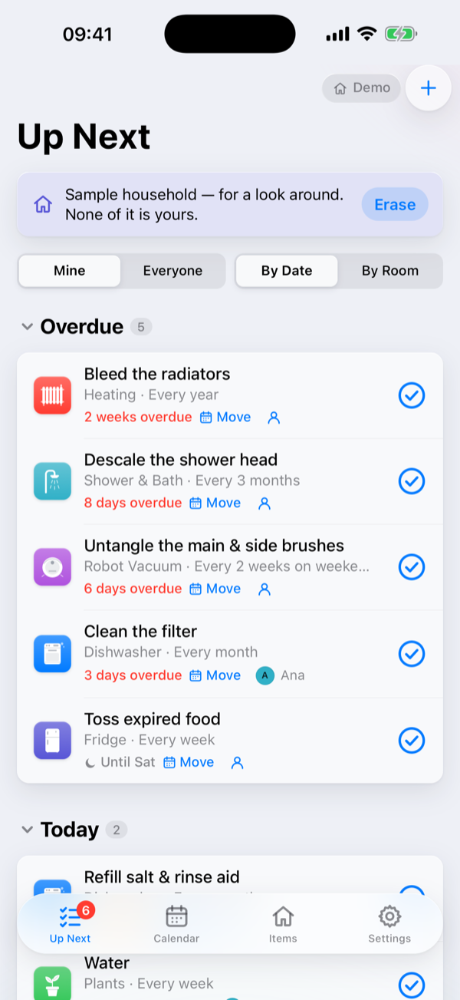
  &nbsp;
  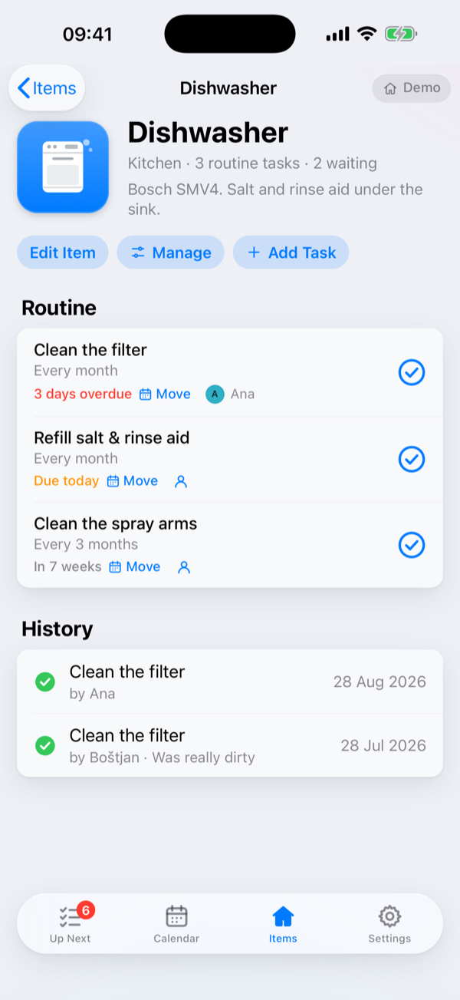
  &nbsp;
  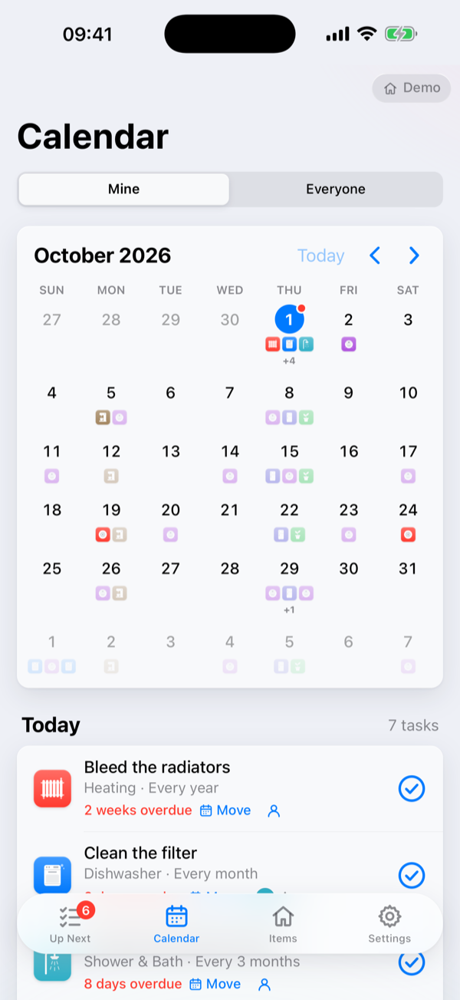
  &nbsp;
  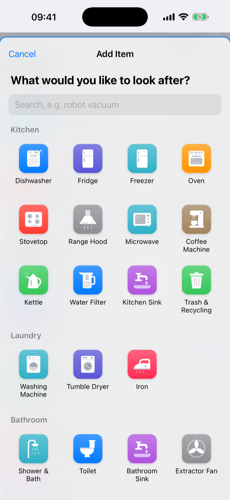
</p>

## What you need

- A Mac with **macOS 15 Sequoia or newer**, on Apple Silicon or Intel.
- **iCloud Drive** turned on, if you want to share the household with someone or keep the automatic backups.
- Optional: an **iPhone or iPad** for each person, on the same Wi-Fi as the Mac when you set it up.

## 1. Install Upkeep on your Mac

1. Download **`Upkeep-X.Y.Z.dmg`** from the [latest release](../../releases/latest).
2. Open it and drag **Upkeep** onto **Applications**.
3. Open Upkeep from Applications. The first time, macOS says it can't check the app for malicious software,
   because Upkeep isn't sold through the App Store. Click **Done**, then go to **System Settings › Privacy &
   Security**, scroll down and click **Open Anyway** next to Upkeep. You only do this once.
4. If macOS asks to let Upkeep **find devices on your local network**, click **Allow**. That's how your phones
   find the Mac.

Upkeep lives in the menu bar. Closing its window doesn't quit it, so your reminders keep coming.

> To check the download, compare it against `SHA256SUMS.txt` from the same release:
> `shasum -a 256 Upkeep-X.Y.Z.dmg`

## 2. Set up your household

The first time Upkeep opens, it asks how you want to start:

- **Start a new household** creates an *Upkeep Household* folder in your iCloud Drive. Pick this if you're the
  first person in your home to use Upkeep.
- **Join a household shared with me** is for when someone has already invited you (see the next step). Accept their
  invitation first, then pick the shared folder. If one is already in your iCloud Drive, Upkeep offers it with one
  click.

Then tell Upkeep **who you are** and **when you usually do chores**, and add your first things with **Add Item**
(`⌘N`). Search or browse the catalog, tick the routines you want, adjust their schedules, and say when each was
last done if you know.

## 3. Invite the rest of your household

In **Settings › Household**, add each person, then:

- **They have a Mac:** click **Invite…** and share the folder with their Apple ID, allowing changes. They install
  Upkeep and choose **Join a household shared with me**.
- **They only have a phone:** click **Pair a Phone…** and follow the next step on their phone.

## 4. Put Upkeep on your iPhone or iPad

The phone app comes from your Mac, so do this at home, on the same Wi-Fi, with Upkeep running on the Mac. It takes
about two minutes per phone. Keep the Mac and the phone side by side: the Mac shows each next step by itself as soon
as the phone has finished the one before.

### Start on the Mac

<table>
  <tr>
    <td width="50%" valign="top">
      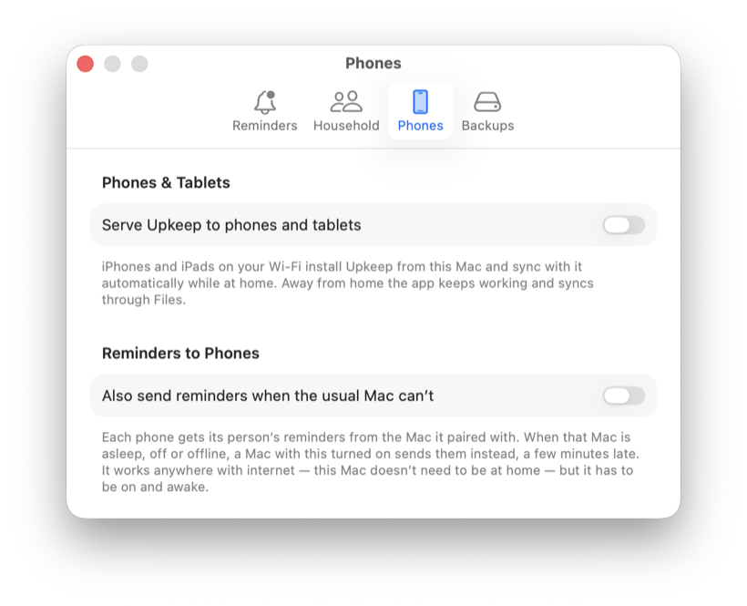
    </td>
    <td width="50%" valign="top">
      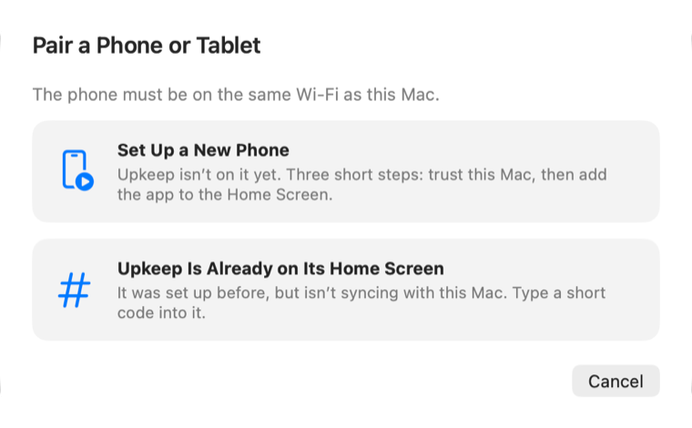
    </td>
  </tr>
  <tr>
    <td valign="top">
      <strong>1.</strong> Open <strong>Upkeep › Settings… › Phones</strong> and turn on <strong>Serve Upkeep to phones
      and tablets</strong>. The first time, allow Upkeep to find devices on your local network if macOS asks.
    </td>
    <td valign="top">
      <strong>2.</strong> Click <strong>Pair a Phone…</strong> and choose <strong>Set Up a New Phone</strong>.
    </td>
  </tr>
</table>

### Step 1 of 3: open the setup page

<table>
  <tr>
    <td width="58%" valign="top">
      <p><strong>On the Mac</strong></p>
      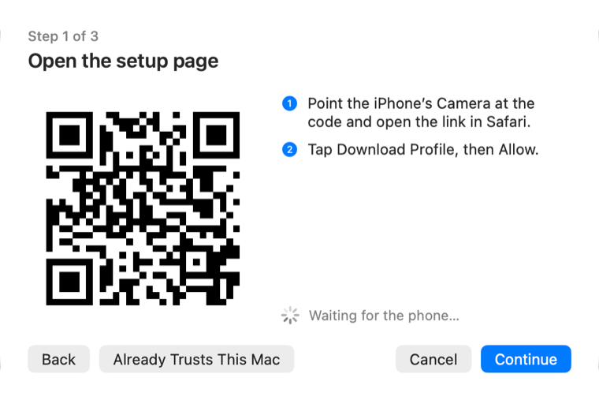
    </td>
    <td width="42%" valign="top">
      <p><strong>On the phone</strong></p>
      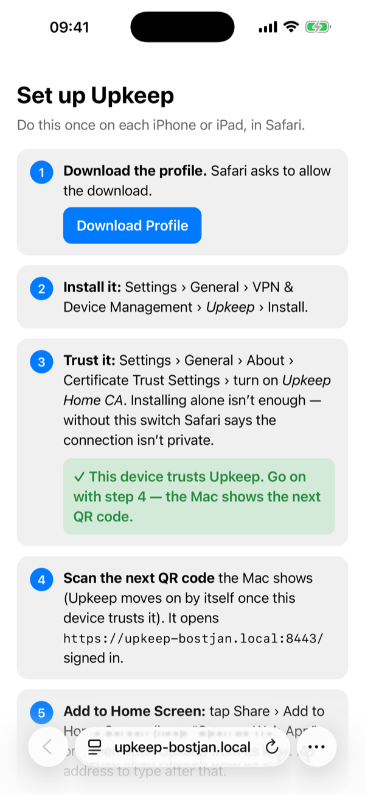
    </td>
  </tr>
  <tr>
    <td colspan="2">
      Point the iPhone's <strong>Camera</strong> at the QR code and tap the link. The <em>Set up Upkeep</em> page opens
      in Safari. Tap <strong>Download Profile</strong>, then <strong>Allow</strong>.
    </td>
  </tr>
</table>

### Step 2 of 3: install and trust the profile

<table>
  <tr>
    <td width="58%" valign="top">
      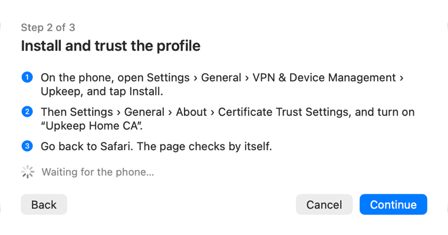
    </td>
    <td width="42%" valign="top">
      <ol>
        <li>On the phone, open <strong>Settings › General › VPN &amp; Device Management</strong>, tap
          <strong>Upkeep</strong> and <strong>Install</strong>.</li>
        <li>Then <strong>Settings › General › About › Certificate Trust Settings</strong>, and turn on
          <strong>Upkeep Home CA</strong>. Installing alone isn't enough.</li>
        <li>Go back to Safari. The page checks by itself and turns green: <em>This device trusts Upkeep</em>.</li>
      </ol>
    </td>
  </tr>
  <tr>
    <td colspan="2">
      <sub>Why a profile? iOS only lets a web app work offline when its connection is secure. The profile makes your
      phone trust your own Mac, and nothing else. Nothing is sent over the internet.</sub>
    </td>
  </tr>
</table>

### Step 3 of 3: add Upkeep to the Home Screen

<table>
  <tr>
    <td width="58%" valign="top">
      <p><strong>On the Mac</strong></p>
      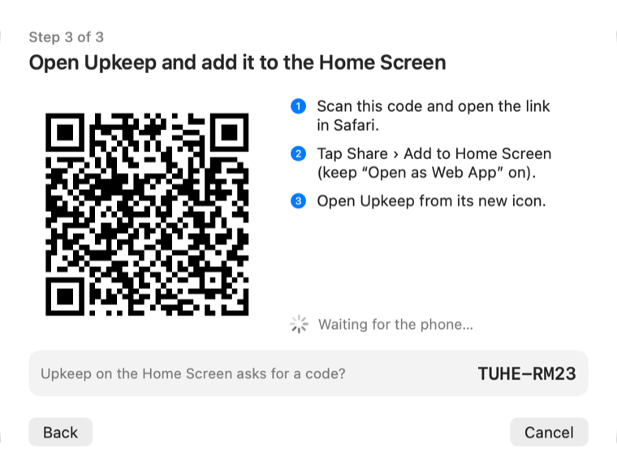
    </td>
    <td width="42%" valign="top">
      <p><strong>On the phone</strong></p>
      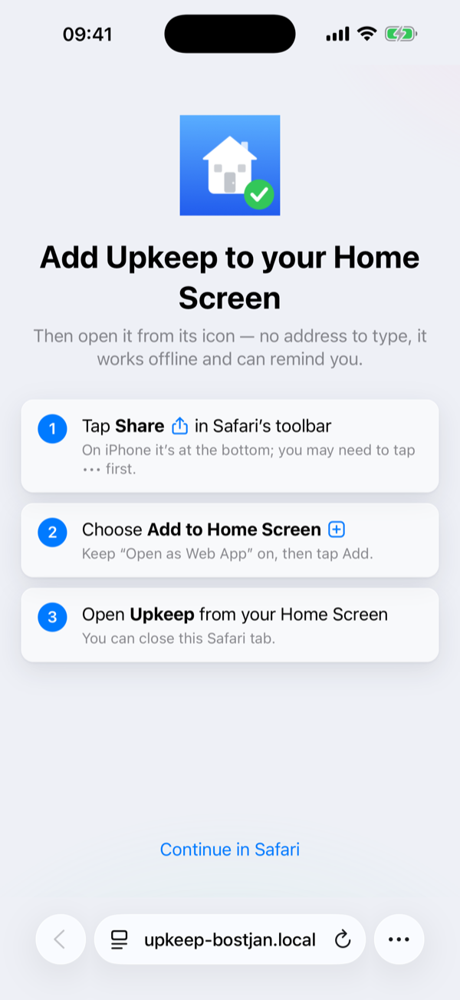
    </td>
  </tr>
  <tr>
    <td colspan="2">
      Scan the <strong>second QR code</strong> the Mac now shows. It opens Upkeep in Safari, already linked to your
      household.
    </td>
  </tr>
</table>

<table>
  <tr>
    <td width="33%" valign="top">
      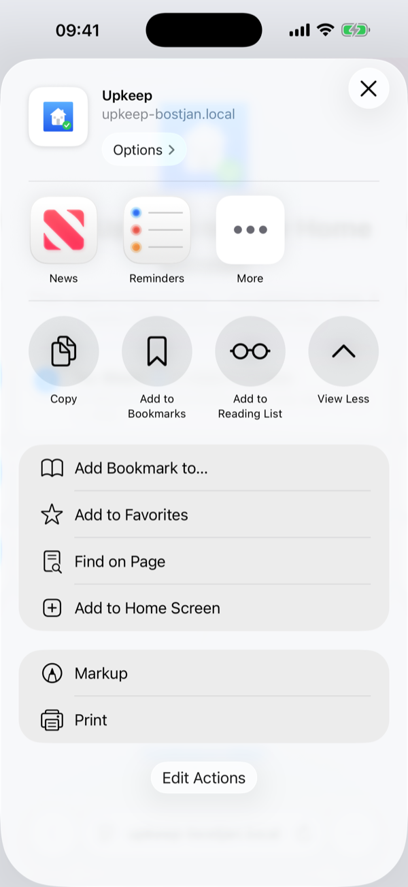
    </td>
    <td width="33%" valign="top">
      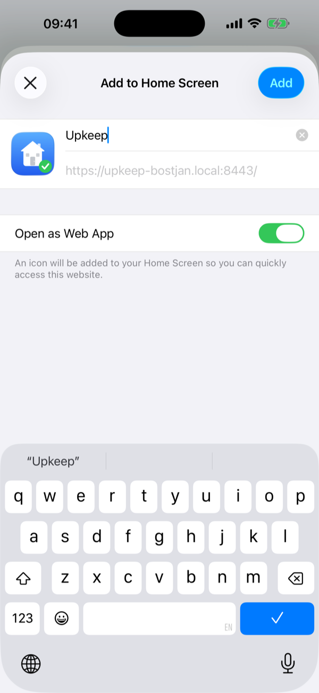
    </td>
    <td width="33%" valign="top">
      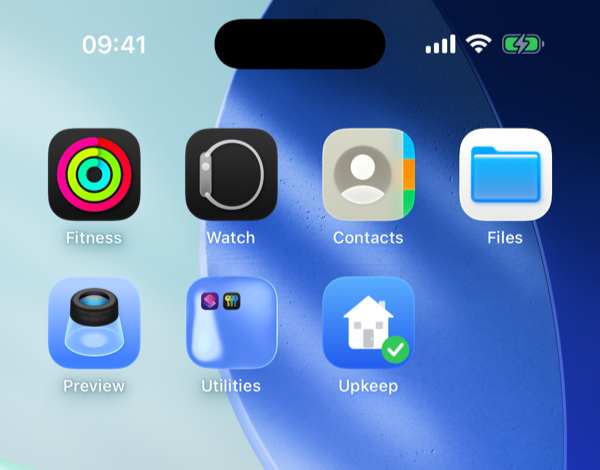
    </td>
  </tr>
  <tr>
    <td valign="top">
      Tap <strong>Share</strong> in Safari's toolbar (on iPhone you may need to tap <strong>•••</strong> first), then
      <strong>View More</strong> and <strong>Add to Home Screen</strong>.
    </td>
    <td valign="top">
      Keep <strong>Open as Web App</strong> on and tap <strong>Add</strong>. That's what makes it a real app that
      works offline; without it, it's just a bookmark.
    </td>
    <td valign="top">
      Open <strong>Upkeep</strong> from its new icon, and from now on always open it from there. Leave it open a few
      seconds the first time so it can save its offline copy: <strong>Settings › About › Offline Copy</strong> says
      <em>Ready</em>.
    </td>
  </tr>
</table>

As soon as the phone syncs, the Mac's wizard says **All set**: *the phone is paired*. It then appears under **Paired with
This Mac** in Settings › Phones.

**Upkeep already on the Home Screen** (for example after resetting the Mac)? On the Mac choose **Upkeep Is Already
on Its Home Screen** instead. On the phone, go to **Settings › Sync at Home** and type the short code the Mac shows.

## 5. Turn on reminders on your phone

In the phone app, open **Settings** and tap **Turn On Notifications**, then allow them. Your Mac sends reminders to
your phone through Apple's push service, so they arrive anywhere you have internet. They follow the same reminder
settings as on the Mac.

Reminders come from the Mac while it's awake. If your household has more than one Mac, turn on **Settings › Phones ›
Also send reminders when the usual Mac can't** on the others, and they'll step in when the usual one is asleep.

## Everyday use

- **Tick things off** with the big ✓ on the Mac, the phone, the menu bar tray or the notification itself.
- **Up Next** shows this week. Switch between **Mine** and **Everyone**, and group **By Date** or **By Room**.
- **Calendar** shows when things are coming up. Later dates are projected: where they'd land if you keep up.
- **Items** lists everything by room. Open one to see its routine and history, edit it, add tasks, or **Manage** which
  suggested routines it has.
- **Move** a task (this time only, or this and all future times) or tap the person to hand it to someone else just
  this time.
- The **dock badge** and the **phone's app badge** count what needs your attention.

**The status in the phone's top-right corner** tells you where you stand: *At home* when it can reach the Mac,
*Syncing…* and *Synced* as your changes travel, *Away* or *Offline* when it can't. A dot means changes are waiting
to sync. Tap it to sync now.

## Away from home

The phone app keeps working with no connection. Tick things off as usual; they sync when you're back on the home
Wi-Fi. If you're away for a long time and want to sync anyway, use **Settings › Export to Files…** and save the file
into iCloud Drive › Upkeep Household › devices, choosing **Replace**. Every Mac picks it up.

## Backups

Every Mac saves the whole household to **iCloud Drive › Upkeep › Backups** a few seconds after any change: one file
per day, keeping the last 30. **Settings › Backups** has **Back Up Now**, **Export…** and **Restore…**. A restore
reaches the whole household, and saves the current data as a *before restore* file first, so it can be undone.

## Updating

Install the new version from the [latest release](../../releases/latest) the same way: drag it onto Applications and
choose **Replace**. Your data stays. Phones update themselves the next time you open the app at home.

## Trying it with sample data

On a phone, tap **Settings › About › Upkeep** seven times to unlock **Developer**, then **Load the Sample
Household**. You get a pretend home with two people, eight things and a year of history, good for showing Upkeep
to someone. It erases the phone's copy first and unpairs it, so the sample can never reach your real household.
**Erase All Data on This Device** puts the phone back to a fresh start; your household is untouched on every
other device.

## Troubleshooting

<details>
<summary><strong>Safari says “This Connection Is Not Private”</strong></summary>

The phone doesn't trust your Mac yet. Check that the profile is installed (Settings › General › VPN & Device
Management) **and** that **Upkeep Home CA** is switched on in Settings › General › About › Certificate Trust
Settings. If both are done, the profile may be from an older certificate: remove it and scan the first QR code
again.
</details>

<details>
<summary><strong>The phone can't reach the Mac</strong></summary>

- Is the phone on the same Wi-Fi as the Mac, and is the Mac awake with Upkeep running?
- On the Mac: **System Settings › Privacy & Security › Local Network** must allow Upkeep. If the macOS firewall is
  on, it must allow Upkeep's incoming connections.
- **Settings › Phones** on the Mac shows the network name the phones use and whether it's working.
</details>

<details>
<summary><strong>“Upkeep won't open away from home: its offline copy is missing”</strong></summary>

Open Upkeep at home with the Mac running and leave it open for a few seconds. It downloads its offline copy again by
itself; tap **Fix** if the banner stays. **Settings › About › Offline Copy** should say *Ready*.
</details>

<details>
<summary><strong>Reminders don't arrive on the phone</strong></summary>

Reminders need the app on your Home Screen (not a Safari tab), notifications allowed, and the Mac that sends them
awake. **Settings › Phones** on the Mac lists every paired phone with a **Test** button.
</details>

---

# Development

## Tech stack

| Part | Built with |
|---|---|
| Mac app | Swift, SwiftUI, SwiftData, UserNotifications. No sandbox, no CloudKit, no paid developer account. |
| Phone app | A PWA: Vite, React 18, TypeScript, Dexie (IndexedDB), Workbox service worker |
| Phone server | Built into the Mac app: Network.framework HTTPS server, its own home CA, mDNS name, Web Push (RFC 8291) |
| Sync | Plain JSON files in a shared iCloud Drive folder, merged with last-writer-wins and a hybrid logical clock |
| CI | GitHub Actions on macOS 26: tests, Universal build, GitHub Release with `.dmg` and `.zip` |

## Getting started

You need macOS 15+, **Xcode** (in `/Applications`) and **Node.js 20.19+** (22 recommended).

```bash
git clone <this repo> && cd house-maintenance
(cd Web && npm install)
open Upkeep.xcodeproj
```

Run the **Upkeep** scheme. The *Build Web App* build phase builds `Web/` with npm and bundles it into the app. To sign
with your Apple team, create `Config/Signing.local.xcconfig` (ignored by git) containing
`DEVELOPMENT_TEAM = <your Team ID>`, or pick a team in Signing & Capabilities.

| Scheme | What it runs |
|---|---|
| **Upkeep** | Your own household. Its Run arguments carry `-demo`, `-serve`, `-pairtoken DEMO1234` and `-selftest`, ready to tick in Edit Scheme › Run › Arguments. |
| **Upkeep Demo** | `-demo`: an in-memory sample household, never synced or backed up. Tick `-serve` and `-pairtoken DEMO1234` to serve it to a phone with a known pairing code. |
| **Upkeep Self-Test** | `-selftest`: two in-memory replicas exchange changes through the real sync path, print the result and quit. |

### Without Xcode's UI

```bash
Tools/build-local.sh && open build/local/Upkeep.app
```

A debug build of this Mac's chip, with its own bundle id, so its settings (device id, who you are, household folder)
are separate from the Xcode build. Handy for playing two household members on one Mac. Both share the database in
`~/Library/Application Support/Upkeep/Household.store`. `SKIP_WEB=1` skips the web app. Debug builds accept:

- `-demo`: in-memory sample household, never backed up or synced.
- `-selftest`: two in-memory replicas sync through the real SwiftData path; exits with the result.
- `-demo -serve -pairtoken T`: serve the demo data to phones with a known pairing token.

### The web app on its own

```bash
cd Web
npm run dev        # Vite dev server; Settings › Developer › Load Demo Data seeds a household
npm run build      # typecheck, then build to dist/
npm run typecheck
```

The service worker only runs in production builds. To test the phone app against your running Mac, point the Mac at
your working copy (read at server start, so restart Upkeep):

```bash
defaults write com.bostjancigan.Upkeep.local phoneWebRoot "$PWD/Web/dist"
```

```bash
defaults delete com.bostjancigan.Upkeep.local phoneWebRoot
```

## Tests

```bash
Tools/test-core.sh
```

```bash
cd Web && npm test
```

```bash
build/local/Upkeep.app/Contents/MacOS/Upkeep -selftest
```

`Tools/test-core.sh` checks the sync core, scheduling maths and Web Push crypto (against the RFC 8291 test vector).
It uses the shared fixtures in `Web/test/fixtures/` to confirm both sides agree: the same merge result, and the same
due date for every case in `schedule.cases.json`. Web tests run in `Europe/Ljubljana` so daylight-saving cases are
exercised.

To act as a second Mac on one machine, `Tools/test-copy.sh NAME run -serveToPhones YES -phoneHTTPSPort 9443
-phoneSetupPort 9080` runs a disposable copy with its own settings, home folder and household. Finish every manual
test with `Tools/dev-cleanup.sh`: it quits leftover test copies so they withdraw their network names, checks no
development name still answers, and deletes the copies and their settings.

## Building a release

```bash
./build.sh
```

Makes a Universal release build (Apple Silicon and Intel) as `build/Upkeep.dmg` and `build/Upkeep.zip`.
`UPKEEP_VERSION` and `UPKEEP_BUILD` set the version the app reports.

Run `Tools/make-signing-identity.sh` once to create your own code-signing certificate (“Upkeep Local Signing”, in
your login keychain). Every build is then signed with it. Without it builds are signed ad hoc, which macOS knows
only by that build's fingerprint, so permissions such as Local Network have to be granted again after every
rebuild. If a build stops at `codesign`, macOS is waiting for you to allow keychain access.

**Publishing:** `.github/workflows/release.yml` runs the tests, builds and publishes a GitHub Release with
`Upkeep-X.Y.Z.dmg`, `.zip` and `SHA256SUMS.txt`. Start it from **Actions › Release › Run workflow** (pick patch,
minor or major; the next version comes from the latest `v*` tag), or push a tag such as `v1.2.0`. Versions live
only in git tags.

## How it's built

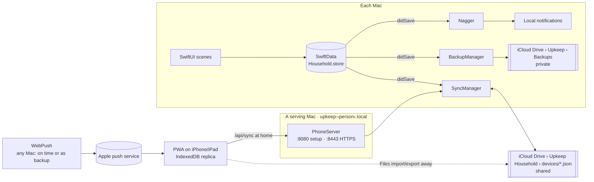

**One household, many full copies.** Every Mac and phone keeps a complete copy of the household. Each device writes
only its own file, `Upkeep Household/devices/<deviceId>.json`, and the household is the merge of all of them. There
is no master and no server.

**Sync.** Every synced model becomes a record `{kind, uid, modifiedAt, modifiedBy, data}`. Before each export,
changed records are stamped with a hybrid logical clock. The merge is last-writer-wins per record plus tombstones
for deletions; it's commutative and idempotent, so every device converges. Derived fields (`lastDoneAt`,
`nextDueAt`) are recomputed from the history on every device. Unknown kinds and fields from newer builds are kept
and passed on. Macs merge on launch, when the folder changes, after edits and every 5 minutes. The full contract,
shared by the Swift and TypeScript sides, is [`Docs/Sync.md`](Docs/Sync.md); the file format is
[`Docs/upkeep-household.v1.schema.json`](Docs/upkeep-household.v1.schema.json).

**Phones.** A Mac with *Serve Upkeep to phones* on runs a small HTTPS server (`:8443`, plus a plain `:8080` for the
setup page) and announces `upkeep-<person>.local` over multicast DNS, so each person's Mac serves their own phones
and the name survives the Mac being renamed. It acts as a tiny private certificate authority
(`~/Library/Application Support/Upkeep/TLS`), because iOS only runs offline web apps from trusted HTTPS. The phone
syncs with `POST /api/sync` using the pairing token from the QR code. The Mac sends reminders as Web Push through
Apple's push service, with the same time slots as its own notifications.

**The phone app** ([`Web/`](Web/README.md)) is a PWA with an IndexedDB replica of the household and a Workbox
service worker that precaches the whole app, so it opens and works with no connection. It checks its own offline
copy at every launch and repairs it from the Mac when something is missing.

**Reminders.** The *Nagger* rebuilds all pending notifications on any change, on activation and every 15 minutes:
clock-aligned slots within the person's active hours, skipping off-days and work hours, for the current week only.

### Repository layout

```
Upkeep/                     the Mac app
  UpkeepApp.swift           scenes, AppState, persistence, demo data, launch arguments
  Core/                     kind-agnostic plumbing, reusable by future modules
    SyncCore.swift          record and snapshot format, merge, hybrid clock (pure, unit-tested)
    SyncStore.swift         SyncableModel, registry, stamping, applying merges
    SyncManager.swift       the household folder: read peers, merge, write own file, folder watch
    People.swift            Person, Household (this device's identity and folder)
    Backup.swift            private rolling backups, export and restore
    FactoryReset.swift      Erase Everything
    PhoneServer/            HTTPS server, home CA and profile, mDNS name, Web Push
  Modules/Maintenance/      items, tasks, logs: models, Schedule maths, catalog, Nagger, views
  Views/                    window, menu bar, settings, household and phone settings
  Icons/                    item icons (SVG), shared with the phone app
Web/                        the iPhone/iPad app (see Web/README.md)
  src/core/                 dates, clock, merge, Dexie database, sync transports, offline copy
  src/modules/maintenance/  schedule, actions, screens
  src/app/                  shell, onboarding, settings, banners
  src/sw.ts                 service worker: precache, offline launch, push
Tests/Core/                 Swift tests for the sync core, scheduling and push crypto
Tools/                      build, test, signing and icon scripts
Docs/                       sync contract, file schema, design notes, README images
Config/                     signing settings and entitlements
```

More detail: [`Docs/Upkeep.md`](Docs/Upkeep.md) (features, data model, how the nagger works, gotchas) and
[`Web/README.md`](Web/README.md) (the phone app).

### Gotchas

- `IconKey` raw values, record kinds and `data` keys are synced: **never rename** one (see `Docs/Sync.md`).
- Writers must emit every key of a kind, or two builds re-stamp each other's records forever.
- The phone server needs the Local Network permission and the firewall to allow incoming connections.
- Development builds answer at a random `upkeep-dev-….local`, never at a real person's name.

### Icons

```bash
swift Tools/render_icons.swift . sheet.png
```

Renders a contact sheet of all SVGs and regenerates the app icons: the Mac's, the phone app's (full-bleed, since
iOS rounds the corners itself), and the flat white notification badge.

---

# License

Upkeep is open source under the [Apache License 2.0](LICENSE). Copyright 2026
[Boštjan Cigan](https://bostjan-cigan.com).

You can use, change and share it, also commercially. If you distribute Upkeep or something built on it,
including a fork, keep the [`NOTICE`](NOTICE) file with it: it names Boštjan Cigan as the original author and
links back to [github.com/bostjan-cigan/upkeep](https://github.com/bostjan-cigan/upkeep). Files you change must
say that you changed them.
